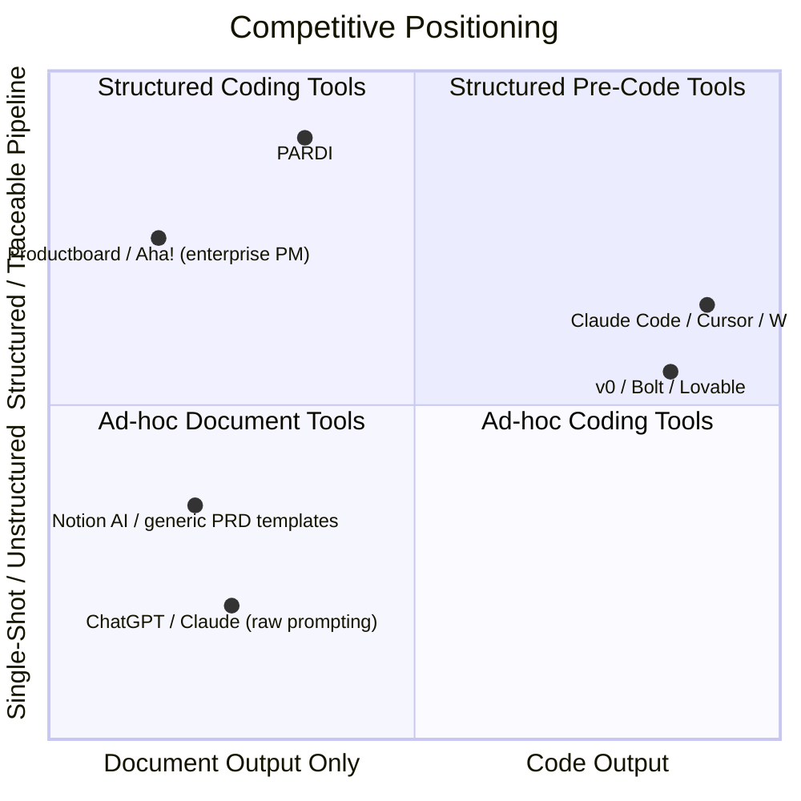

# 04 — Competitor Analysis

## 4.1 Competitive Landscape Map

Competitors fall into four distinct categories that solve *adjacent* but not *identical* problems. PARDI's competitive claim is that none of them own the full pipeline from idea to agent-executable spec.

## 4.2 Direct Competitors (Pre-Code Spec/PRD Tools)

| Competitor | What they do well | Where they fall short vs. PARDI |
|---|---|---|
| Generic "AI PRD generator" tools (numerous small SaaS/GPT-wrapper products) | Fast, cheap, simple PRD from a prompt | Single-shot output; no schema/API/task derivation; no staleness tracking; nothing agent-executable comes out the other end |
| Notion AI (used for PRD writing) | Great as a living workspace once content exists; strong collaboration | Not opinionated — it assists writing, it doesn't architect; no concept of a pipeline or derived artifacts |
| Productboard, Aha! (enterprise product management) | Deep roadmap/prioritization tooling, strong for large PM orgs | Priced and scoped for enterprise PM teams, not solo builders; no AI-native generation of schema/API/tasks; heavy onboarding |

> **Decision:** We do not treat generic "AI PRD generator" GPT-wrapper tools as a serious long-term threat individually — they are easy to build and have weak retention. The category itself is a signal of demand, not a durable competitor. PARDI's response is to make the *chain* (PRD → schema → API → tasks → prompts) the product, which is structurally harder to clone as a weekend wrapper.

## 4.3 Indirect Competitors (Coding Agents with Planning Features)

| Competitor | What they do well | Where they fall short vs. PARDI |
|---|---|---|
| Claude Code (plan mode / extended thinking before edits) | Excellent at turning a plan into correct code; plan mode reduces some ambiguity in-session | Planning is session-scoped and disposable — it doesn't produce a versioned, portable schema/API/PRD a user can revisit, share, or hand to a different agent later |
| Cursor / Windsurf (composer / agent modes) | Strong at multi-file reasoning once a spec-like prompt is given | Same limitation: internal planning artifacts aren't first-class, exportable, human-reviewable product documents |
| v0 / Bolt / Lovable (prompt-to-app builders) | Extremely fast for UI scaffolding and prototypes | Optimized for surface-level scaffolding speed, not for durable backend/data-model correctness; no concept of PRD/BRD/user stories as artifacts at all |

> **Decision:** This is the category to watch most closely (see `29_Risk_Analysis.md`, Risk #1). If a coding agent's internal planning step becomes durable, versioned, and exportable, it directly competes with PARDI's core value prop. PARDI's defense is breadth (full PM-to-architecture pipeline, not just a coding plan) and portability (PARDI's output should be usable with *any* coding agent, not just one vendor's).

## 4.4 Adjacent / Aspirational Comparables (Quality Bar, Not Competitors)

Linear, Stripe, Vercel, Notion, and OpenAI are referenced throughout this repo (see `17_UI_UX_Design_System.md`) as a *design and documentation quality bar*, not as competitors — none of them build product-specification tooling. They set the expectation for polish that PARDI is held to.

## 4.5 Feature Gap Analysis

| Capability | Generic PRD tools | Enterprise PM tools | Coding agents (plan mode) | PARDI |
|---|---|---|---|---|
| Idea validation / market & competitor analysis | Rare | No (assumes validated idea) | No | Yes |
| Structured PRD + BRD | Yes | Yes | No | Yes |
| Schema/ERD derived from stories | No | No | No | Yes |
| API contract derived from schema | No | No | Sometimes (implicit, in-session) | Yes |
| Task breakdown mapped to architecture | No | Partial (manual) | Partial (in-session) | Yes |
| Coding-agent-ready prompt export | No | No | N/A (is the destination) | Yes |
| Multi-agent role specialization (PM/Architect/DBA/Security) | No | No | No | Yes |
| Cross-artifact staleness tracking | No | No | No | Yes |

## 4.6 Strategic Implication

PARDI does not win by being a better writer of any single document. It wins by being the only tool where **the PRD, schema, API, and task breakdown are provably consistent with each other**, and where that consistency is maintained automatically as the idea evolves. Every roadmap prioritization decision (`27_Roadmap.md`) should be checked against whether it strengthens this specific claim before anything else.
