# 06 — Product Requirements Document (Core PRD)

## 6.1 Purpose of This Document

This is the canonical PRD: it defines *what* PARDI is in v1, at what scope, for whom, and with what priority. `07_Functional_Requirements.md` expands each feature into detailed behavior; `08_Non_Functional_Requirements.md` covers performance/security/scale targets. This file is the contract between product strategy (`02_Product_Strategy.md`) and everything downstream.

## 6.2 Product Goal (v1)

Ship a product where a user can go from a one-paragraph idea to an exported, coding-agent-ready prompt set for at least one full feature, end-to-end, inside a single sitting — and where every artifact along the way is traceable back to the idea that produced it.

> **Decision:** v1 scope is bounded by "one full pipeline run, working well" rather than "all 20+ features listed in the master feature set, partially working." A user who completes Idea → Prompt for one project and trusts the output is worth more at launch than a user who samples ten shallow features. Feature prioritization below enforces this.

## 6.3 The Pipeline (Product Backbone)

```mermaid
flowchart LR
    A[Idea] --> B[AI Interview]
    B --> C[Idea Validation]
    C --> D[Market / Competitor Analysis]
    D --> E[PRD]
    E --> F[BRD]
    F --> G[User Stories + Acceptance Criteria]
    G --> H[System Architecture]
    H --> I[Database Design / ERD]
    I --> J[API Design]
    J --> K[Task Breakdown]
    K --> L[Coding Prompts]
    L --> M[Deployment Checklist]
```

Every node is a **stage**; every stage produces a **versioned artifact**; every artifact stores a pointer to the upstream artifact(s) it was derived from. This dependency graph is what `08_Non_Functional_Requirements.md` and `12_Database_Design.md` must support structurally — it is not an add-on feature, it's the data model.

## 6.4 Feature Inventory and Priority (v1)

Priority key: **P0** = required for v1 launch, product doesn't make its core promise without it. **P1** = required for v1 to be *competitively* credible, ships same quarter as P0 where feasible. **P2** = post-v1, expansion phase (`27_Roadmap.md`).

| Feature | Priority | Pipeline Stage | Notes |
|---|:---:|---|---|
| AI Interview | P0 | Idea intake | Structured clarifying-question flow, not a blank chat box |
| Idea Validation | P0 | Validation | Feasibility + scope-sanity check before PRD generation |
| Market Validation | P1 | Validation | Lightweight, clearly-labeled-as-directional (see `03_Market_Research.md` for why) |
| Competitor Analysis | P1 | Validation | Structured competitor table generation from user input + web context |
| PRD Generator | P0 | Spec | Core deliverable; must support edit + regenerate-downstream |
| BRD Generator | P1 | Spec | Business-requirement framing, output distinct from PRD, not a re-format of it |
| User Story Generator | P0 | Spec | Must produce stories the Acceptance Criteria Generator can consume directly |
| Acceptance Criteria Generator | P0 | Spec | Given/When/Then structure by default |
| Database Designer | P0 | Architecture | Must output both human-readable ERD and machine-readable schema |
| ERD Generator | P0 | Architecture | Visual companion to Database Designer, same underlying model |
| API Designer | P0 | Architecture | Derived from schema; contract-first, not code-first |
| Architecture Generator | P0 | Architecture | System diagram + component boundaries |
| Tech Stack Recommendation | P1 | Architecture | Opinionated, with reasoning (`20_Tech_Stack.md` is the reference implementation of this feature applied to PARDI itself) |
| Sprint Planner | P2 | Execution | Depends on team/workspace maturity; not needed for solo-builder wedge |
| Task Breakdown | P0 | Execution | Must map 1:1 to architecture + API artifacts, not be freehand |
| Prompt Generator | P0 | Execution | The hand-off artifact; success metric anchor from `01_Executive_Summary.md` |
| Export System | P0 | Execution | Markdown/JSON export minimum; must support "copy prompt" as a first-class action |
| Version History | P0 | Cross-cutting | Required for the dependency-graph/staleness promise to mean anything |
| AI Reviewer | P1 | Cross-cutting | Consistency-checks artifacts against each other |
| AI Product Critic | P1 | Cross-cutting | Adversarial pass — pokes holes in the PRD/stories before the user commits |
| AI Product Coach | P2 | Cross-cutting | Explanatory/teaching mode, primarily serves secondary personas (Sinta) |
| Collaboration | P1 | Cross-cutting | Comment + share; full multi-editor real-time is P2 |
| Workspace | P1 | Cross-cutting | Multi-project organization, required once a user has 2+ projects |
| Billing | P0 | Platform | Required to operate as a business at all |
| Analytics | P1 | Platform | Internal usage analytics to validate `28_KPI.md` |
| Knowledge Base | P2 | Platform | Self-serve support content |
| Template Marketplace | P2 | Platform | Depends on a critical mass of shipped projects to seed it credibly |

## 6.5 Out of Scope (v1)

Explicitly excluded, with reasoning, to prevent scope creep:

- **Writing or executing application code.** PARDI's boundary stops at the coding prompt (`02_Product_Strategy.md §2.7`). Building a code executor duplicates what Claude Code/Cursor/v0 already do well and dilutes focus.
- **Long-term project/task management** (Jira/Linear-style ongoing sprint tracking). Task Breakdown produces an initial plan; it is not meant to replace a team's existing PM tool.
- **Real-time multi-user simultaneous document editing** (Google-Docs-style). v1 collaboration is comment/share/async; real-time co-editing is a P2/Phase-2 investment (`27_Roadmap.md`) once the core pipeline is proven.
- **Fully automated market research** replacing primary user research. Market Validation is a structuring aid, not a substitute for talking to users (see caveats in `03_Market_Research.md`).

## 6.6 Assumptions

- Users arrive with at least a rough idea — PARDI is not an ideation-from-nothing brainstorming tool (that's a different, much broader product).
- Users have or will get access to at least one AI coding agent to consume PARDI's output; PARDI does not need to become a coding agent itself to deliver its value.
- A majority of early users work solo or in teams of ≤5, per the SOM framing in `03_Market_Research.md` — v1 collaboration features are scoped accordingly (P1, not P0).

## 6.7 Dependencies Across This Repo

- Feature behavior detail → `07_Functional_Requirements.md`
- Performance/security/scale constraints on these features → `08_Non_Functional_Requirements.md`
- Screen-level flow for each P0 feature → `09_User_Flow.md`
- Data model implied by the pipeline → `11_System_Architecture.md`, `12_Database_Design.md`
- Multi-agent implementation of "PM/Architect/Reviewer" behaviors → `15_Agent_Workflow.md`
- Pricing gates referenced above (P0 vs P1 vs P2 access by tier) → `26_Pricing.md`

## 6.8 Definition of Done (v1 Launch)

v1 is launch-ready when, for a single project, a user can: complete an AI Interview → get a validated PRD → get BRD, user stories, and acceptance criteria → get a database schema, ERD, and API spec derived from those stories → get a task breakdown mapped to that architecture → export coding-agent prompts for at least the first milestone of tasks — with every artifact showing its version history and its upstream source, and with billing able to gate access by tier along that whole chain.
