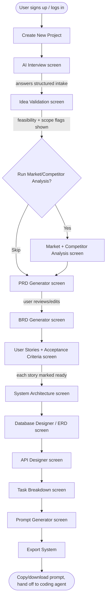
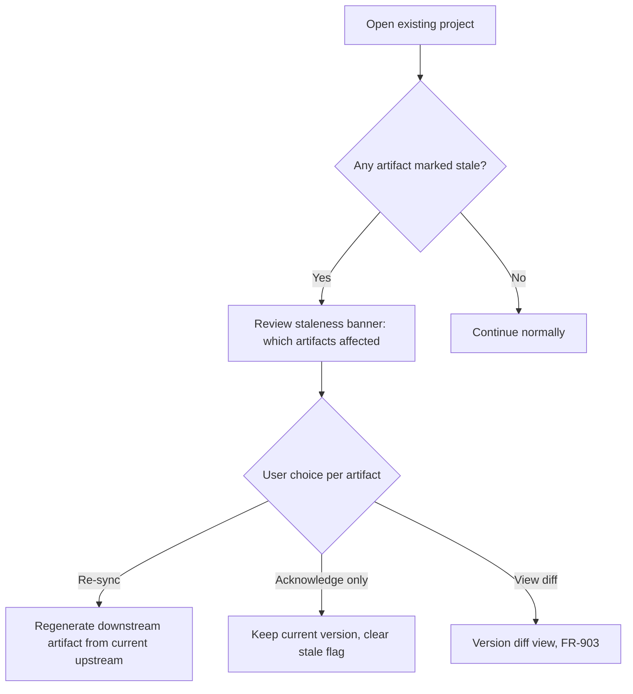

# 09 — User Flow

This document walks the primary end-to-end flow (new project, solo user, v1 P0 features) screen-by-screen, then documents key secondary flows. It is the bridge between `07_Functional_Requirements.md` (behavior) and `17_UI_UX_Design_System.md` (visual execution).

## 9.1 Primary Flow: Idea → Exported Coding Prompts

## 9.2 Screen-by-Screen Detail

### 9.2.1 AI Interview
- Chat-like but structured: each turn maps to a specific captured field (problem, target user, value prop, constraints), shown as a checklist filling in alongside the conversation so the user always sees intake progress, not just a scrolling transcript.
- "Skip / decide later" is always visible per question (FR-103) — never forces an answer to proceed.
- Exit state: structured `interview_data` object (FR-104), visible in a summary panel before continuing.

### 9.2.2 Idea Validation
- Shows three scored dimensions (technical feasibility, market signal, scope realism — FR-111) as a compact scorecard, not a wall of text.
- Any flagged scope mismatch (FR-112) is shown inline with a specific suggested reduction ("Consider deferring multi-currency to v2"), not just a warning icon.
- User can accept, edit constraints, or proceed anyway — validation never blocks (FR-113).

### 9.2.3 Market / Competitor Analysis (optional step)
- Explicit "directional estimate" labeling on any sizing claim (FR-121), visually distinct (muted badge) from sourced/live-fetched claims.
- Competitor table (FR-123) editable inline — user can add a competitor PARDI missed.

### 9.2.4 PRD Generator
- Split view: generated PRD on one side, source interview/validation data on the other, so the user can see *why* a section was written the way it was.
- Every major section has an inline "regenerate this section" action scoped narrower than "regenerate whole PRD," to avoid the frustration of losing good sections to fix one bad one.
- Editing here triggers the staleness cascade (FR-133) — a persistent but non-blocking banner appears once downstream artifacts exist: "3 downstream artifacts may need review."

### 9.2.5 BRD Generator
- Presented as a distinct document type, not a tab restating the PRD — reinforces FR-141.
- Pulls PRD goals by reference (linked, not copied) with a visible source chip a user can click to jump to the originating PRD section.

### 9.2.6 User Stories + Acceptance Criteria
- Kanban-style board grouped by persona (from `05_User_Personas.md`-style project personas) rather than a flat list — makes it easy to see coverage gaps per persona.
- A story cannot be dragged into "Ready for Architecture" without at least one linked acceptance criterion (FR-152) — the UI enforces this with a disabled-state tooltip explaining why, not a silent block.

### 9.2.7 System Architecture
- Mermaid component diagram rendered live (FR-181), regenerated as stories are added/changed.
- Each component is clickable, surfacing which stories/requirements justify its existence.

### 9.2.8 Database Designer / ERD
- Dual view toggle: visual ERD ↔ raw schema definition (FR-162) — always the same underlying model, never two sources of truth.
- Inline review comments for flagged normalization issues (FR-163), dismissible individually with a required one-line justification if the user overrides a flag (audit trail feeds `29_Risk_Analysis.md` quality monitoring).

### 9.2.9 API Designer
- Endpoint list grouped by resource (entity from the schema), each expandable to method/path/request/response/error detail (FR-172).
- Visible traceability chip per endpoint linking back to the schema entity and originating story (FR-171).

### 9.2.10 Task Breakdown
- Tasks grouped by architecture component, each tagged with the API endpoints/schema entities it touches (FR-191).
- Drag-to-reorder within a milestone; milestones map to the phased roadmap concept from `27_Roadmap.md` applied at the project level.

### 9.2.11 Prompt Generator
- One-click "Generate Prompt" per task, producing a self-contained prompt embedding schema/API/acceptance-criteria fragments (FR-192).
- Format toggle: Markdown / JSON (FR-193), with a persistent "Copy" action as the primary CTA — this is the single most-used button in the product and must never be more than one click away.

### 9.2.12 Export System
- Project-level export (full bundle) vs. artifact-level export, clearly separated as two distinct actions to avoid accidental over-export.
- Dependency metadata included in structured export formats (FR-202), silently — no separate action required.

## 9.3 Secondary Flow: Returning to an Existing Project After an Upstream Edit

This flow is the concrete UI expression of FR-133/FR-901–903 and is arguably the single most differentiating interaction in the product relative to competitors listed in `04_Competitor_Analysis.md` — it deserves dedicated design attention disproportionate to its visual simplicity.

## 9.4 Secondary Flow: Collaboration (P1)

- Project owner invites a collaborator by email/link → collaborator gets scoped access (viewer/commenter/editor per `10_Information_Architecture.md` permission model) → comments attach to a specific artifact + version, not floating at the project level, so feedback stays anchored even as artifacts regenerate.

## 9.5 Error / Edge-Case Flows Requiring Explicit Design

- AI generation failure mid-stage: user must see a clear retry action and must NOT lose the previous valid version (NFR-112) — no silent partial overwrite.
- User abandons the pipeline mid-stage and returns days later: project state must resume exactly where left off, with stale-context re-orientation (a brief "here's what you had generated" recap) rather than assuming continuous memory of the session.
- User deletes an upstream artifact that downstream artifacts depend on: must be blocked or require explicit cascading-impact confirmation (ties to NFR-151), never a silent orphaning of downstream data.
