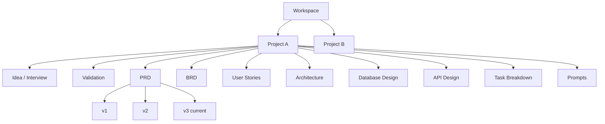

# 10 — Information Architecture

This document defines how PARDI's content is organized and navigated at the product level — the container hierarchy, navigation model, and permission structure that `09_User_Flow.md` screens live inside. Physical schema is in `12_Database_Design.md`; this is the conceptual layer above it.

## 10.1 Entity Hierarchy



> **Decision:** **Workspace** sits above **Project**, not the reverse, even though v1's primary persona (solo builder) will often have exactly one workspace with one active project. This is deliberate: it lets Phase 2 collaboration/billing (team seats, shared templates) attach to Workspace without a schema migration later, and it lets a single user cleanly hold multiple unrelated projects (Dara's side project vs. Aji's startup) without cross-contamination.

## 10.2 Navigation Model

Primary navigation is **workspace-scoped**, not global-search-first, because the product's core interaction is depth within one project's pipeline, not breadth across many:

```
[Workspace Switcher]
 └─ Projects (list)
     └─ [Project]
         ├─ Overview (pipeline progress map — mirrors 6.3 diagram, shows stage completion)
         ├─ Idea & Validation
         ├─ PRD / BRD
         ├─ Stories & Criteria
         ├─ Architecture
         ├─ Database
         ├─ API
         ├─ Tasks & Prompts
         ├─ Exports
         └─ Settings (collaborators, version history, project-level constraints)
 └─ Templates (marketplace — P2)
 └─ Workspace Settings (billing, members, analytics)
```

The **Overview** tab is the most important navigation surface in the product: it is a live rendering of the pipeline diagram from `06_Product_Requirements.md §6.3` with each stage showing complete / in-progress / stale / not-started status, and it is the default landing screen when reopening a project — directly supporting the "resume where left off" requirement in `09_User_Flow.md §9.5`.

## 10.3 Content Model Summary (Conceptual)

| Concept | Belongs to | Has versions? | Can be stale? |
|---|---|---|---|
| Workspace | — (root) | No | N/A |
| Project | Workspace | No (project itself isn't versioned, its artifacts are) | N/A |
| Interview Data | Project | Yes | No (it's the root of the dependency graph) |
| Validation Result | Project | Yes | Yes, relative to Interview Data |
| PRD | Project | Yes | Yes, relative to Validation Result |
| BRD | Project | Yes | Yes, relative to PRD |
| User Story | Project | Yes | Yes, relative to PRD/BRD |
| Acceptance Criterion | User Story | Yes | Yes, relative to its Story |
| Architecture Diagram | Project | Yes | Yes, relative to Stories |
| Schema / ERD | Project | Yes | Yes, relative to Stories + Architecture |
| API Contract | Project | Yes | Yes, relative to Schema |
| Task | Project | Yes | Yes, relative to Architecture + API |
| Prompt | Task | Yes | Yes, relative to Task + its upstream chain |
| Comment | Any artifact + version | No | N/A |

This table is the conceptual source that `12_Database_Design.md` normalizes into actual tables and foreign keys.

## 10.4 Permission Model (Workspace/Project Roles)

| Role | Scope | Can generate/edit artifacts | Can invite others | Can manage billing |
|---|---|---|---|---|
| Owner | Workspace | Yes | Yes | Yes |
| Admin | Workspace | Yes | Yes | No |
| Editor | Project | Yes, on assigned projects | No | No |
| Commenter | Project | No (comments only) | No | No |
| Viewer | Project | No | No | No |

> **Decision:** Permissions are project-scoped for Editor/Commenter/Viewer rather than blanket workspace-wide, even in v1, because Aji's persona (`05_User_Personas.md §5.3`) explicitly needs to bring in engineers who should see architecture/API but not necessarily every early-stage idea validation in the workspace. Building this narrower from the start avoids a breaking permissions migration when Phase 2 collaboration ships.

## 10.5 Findability: Search & Filtering

- Search is scoped by default to the current workspace, with an explicit toggle to broaden to "everything I have access to" — avoids the common failure mode of solo users assuming search is project-scoped and being confused by cross-project results.
- Artifacts are filterable by: stage, status (complete/stale/draft), persona (for stories), and component (for architecture/tasks) — filter dimensions map directly to the columns most used in the screens described in `09_User_Flow.md`.

## 10.6 Cross-References

- Physical schema and constraints implementing this hierarchy → `12_Database_Design.md`
- Visual treatment of navigation → `17_UI_UX_Design_System.md`
- API surface exposing this hierarchy → `13_API_Specification.md`
