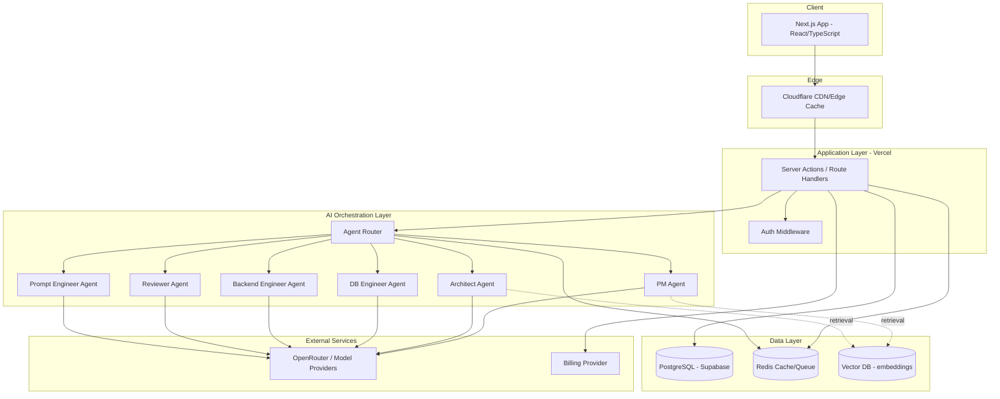
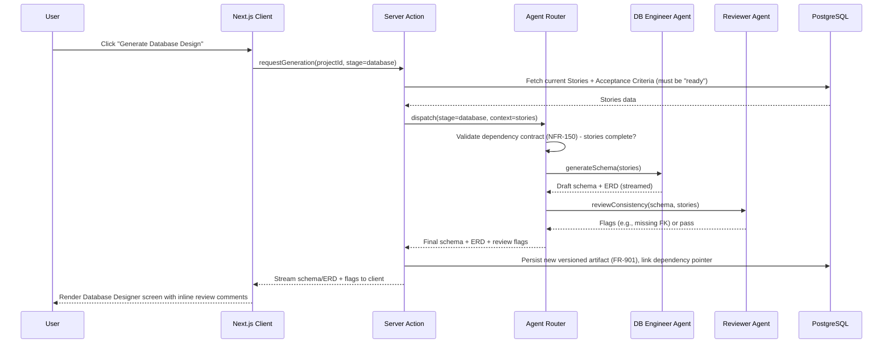
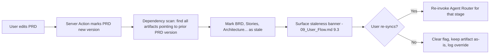

# 11 — System Architecture

## 11.1 Architecture Style

**Modular monolith on Next.js (Server Actions + Route Handlers), with a separately-scalable AI orchestration layer.** Not microservices at v1.

> **Decision:** A full microservices split is rejected for v1. Reasoning: the team is small (per `27_Roadmap.md` staffing assumptions), the domain (pipeline stages) is tightly coupled by design (each stage depends on the last), and premature service boundaries would slow iteration on the exact thing that needs the most iteration right now — the AI reasoning quality per stage. The one boundary that *is* split out immediately is the AI orchestration layer, because it has genuinely different scaling and failure characteristics (NFR-120, NFR-111) from the CRUD API.

## 11.2 High-Level Component Diagram

## 11.3 Component Responsibilities

| Component | Responsibility | Scales independently? |
|---|---|---|
| Next.js App (Client) | Rendering, optimistic UI, client-side state for in-progress edits | N/A (CDN-cached/edge-served) |
| Server Actions / Route Handlers | CRUD on artifacts, auth enforcement, permission checks (`10_Information_Architecture.md §10.4`) | Yes, standard serverless scaling |
| Agent Router | Selects which agent(s) to invoke per stage, assembles upstream artifact context, enforces the dependency-graph contract (NFR-150) before invoking a generation | Yes — this is the component NFR-120 specifically targets |
| Individual Agents (PM/Architect/DB/API/Reviewer/Prompt) | Stage-specific reasoning; each has its own system prompt, tools, and output schema (`15_Agent_Workflow.md`) | Stateless per-call; scale via the Router's queueing |
| PostgreSQL (Supabase) | System of record for all artifacts, versions, and dependency pointers | Managed, vertically scaled initially; see `12_Database_Design.md` for read-scaling notes |
| Redis | Job queue for long-running generation tasks (schema/API/task generation), plus response caching for cheap repeated reads | Yes |
| Vector DB | Embeddings for template marketplace search (P2) and for retrieval-augmented context when regenerating large projects (avoids re-sending entire project history to the model every call) | Yes |
| OpenRouter / Model Providers | Model access abstraction — allows swapping/routing between models without rearchitecting agents | External, provider-managed |

## 11.4 Why an Agent Router (Not Direct Agent Calls from Server Actions)

The Router exists as a distinct layer — not just a helper function — for three reasons tied directly back to requirements elsewhere in this repo:

1. **Dependency enforcement (NFR-150):** before invoking, say, the DB Agent, the Router validates that the required upstream artifacts (stories with linked acceptance criteria, per FR-152) actually exist and are current. This check belongs in one place, not duplicated across every Server Action that might trigger generation.
2. **Graceful degradation (NFR-111):** if OpenRouter/model providers are down, the Router can fail generation requests specifically while the rest of the app (viewing/editing existing artifacts) remains fully available — this requires generation to be architecturally separable from core reads/writes, not intermixed in the same request path.
3. **Multi-agent sequencing (`15_Agent_Workflow.md`):** several stages require more than one agent (e.g., Architecture generation involves the Architect Agent producing a diagram and the Reviewer Agent checking it against Stories) — the Router owns this sequencing so individual agents stay single-responsibility.

## 11.5 Sequence Diagram: Generating a Database Schema from User Stories

This sequence is the template every generation stage follows (Interview excluded, since it has no upstream dependency to validate). `15_Agent_Workflow.md` documents each agent's specific prompt/tool contract; this diagram documents the invariant orchestration shape all of them share.

## 11.6 Data Flow: Staleness Propagation

The staleness scan (NFR-150/151) runs synchronously on every artifact edit — it is cheap (a foreign-key traversal, not an AI call) and must never be skipped for performance reasons, since it's the mechanism the entire "traceable pipeline" differentiation depends on.

## 11.7 Deployment Topology (Summary — detail in `25_Deployment.md`)

- **Vercel**: Next.js app (client + Server Actions/Route Handlers), edge-cached static assets via Cloudflare in front where applicable.
- **Supabase**: Managed PostgreSQL, auth (or integrated with app-level auth), row-level security enforcing NFR-131.
- **Redis**: Managed instance for queue + cache, separate from Supabase.
- **Docker**: Used for any long-running worker processes (e.g., queue consumers for generation jobs) that don't fit serverless function time limits.
- **GitHub Actions**: CI/CD gate before any Vercel deploy (`24_Testing.md`, `25_Deployment.md`).

## 11.8 Failure Isolation Summary

| Failure | Blast radius | Mitigation |
|---|---|---|
| Model provider outage | New AI generation only | Existing artifacts remain viewable/editable; Router surfaces a clear "generation unavailable" state, not a generic app error (NFR-111) |
| Redis outage | Queued/long-running generation jobs stall | Short-lived generation can fall back to synchronous request path; queue-dependent features degrade with a visible status, not silently |
| Supabase/Postgres outage | Full app read/write outage | This is the one true single point of failure at v1 scale; `23_Performance.md` and `25_Deployment.md` define backup/replica strategy |
