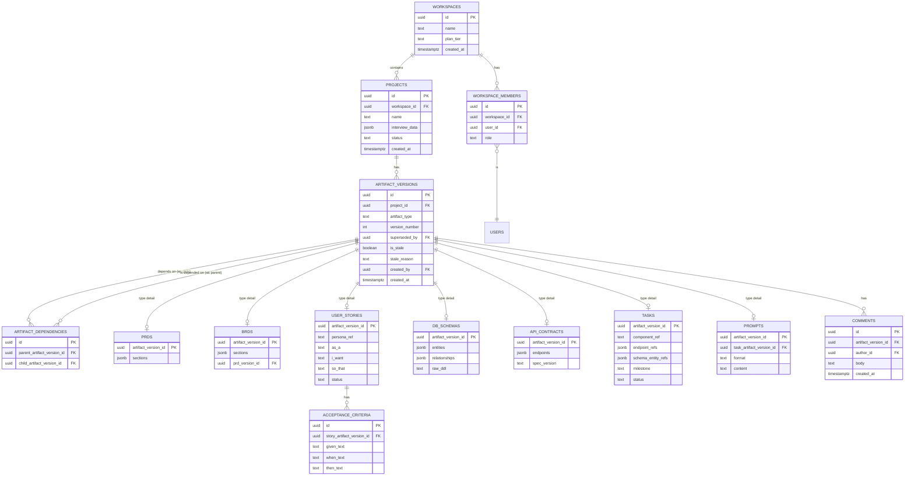

# 12 — Database Design

Implements the conceptual model from `10_Information_Architecture.md §10.3` and the dependency-graph requirements from `08_Non_Functional_Requirements.md §8.6` (NFR-150/151) and `07_Functional_Requirements.md` (FR-901–903, Version History). Target: PostgreSQL via Supabase, accessed through Drizzle ORM (`20_Tech_Stack.md`).

## 12.1 Design Principles

1. **Artifacts are polymorphic but the dependency graph is not.** Every generated artifact type (PRD, BRD, Story, Schema, API Contract, Task, Prompt) has its own table for type-specific fields, but all of them also insert a row into a single `artifact_versions` table that carries the generic version/staleness/dependency metadata. This lets NFR-150 (dependency enforced at the DB level) be implemented once, not per artifact type.
2. **Nothing is overwritten.** Every edit is an insert of a new `artifact_versions` row, never an `UPDATE` of content (FR-901). Type-specific tables reference a specific version row, not a mutable "current" row.
3. **Row-Level Security is the enforcement layer for NFR-131**, not just application-level checks — every tenant-scoped table has RLS policies keyed off `workspace_id`/`project_id` membership.

## 12.2 Core Schema

## 12.3 Table Notes

### `artifact_versions` (the dependency-graph spine)

| Column | Notes |
|---|---|
| `artifact_type` | Enum: `interview`, `validation`, `market_analysis`, `prd`, `brd`, `user_story`, `architecture`, `db_schema`, `api_contract`, `task`, `prompt` |
| `version_number` | Monotonic per `(project_id, artifact_type, [parent story for stories/tasks])` |
| `superseded_by` | Self-referencing FK; null = current version for its lineage |
| `is_stale` / `stale_reason` | Set by the staleness-scan trigger described in `11_System_Architecture.md §11.6`; `stale_reason` stores which upstream dependency changed |

> **Decision:** Dependency tracking lives in a dedicated `artifact_dependencies` join table (parent/child version IDs) rather than a single `parent_version_id` column on `artifact_versions`. Reasoning: several artifacts have *multiple* upstream dependencies (a Task depends on both an Architecture component and one or more API endpoints; an API Contract depends on a DB Schema *and* the Stories that justified each endpoint). A single-parent column can't model this; NFR-150/151 require the full graph, not a tree.

### Staleness Enforcement (DB-level, not just app-level)

A Postgres trigger on `artifact_versions` insert: whenever a new version is created for a given `(project_id, artifact_type)` lineage, the trigger walks `artifact_dependencies` to find all artifact versions whose `parent_artifact_version_id` pointed at the *previous* current version of this lineage, and sets `is_stale = true` on each, with `stale_reason` populated. This guarantees NFR-151 (no silent orphaning) even if application code has a bug — the constraint lives where FR-133 actually needs it enforced.

### `user_stories` / `acceptance_criteria`

- `persona_ref` is a string reference to a project-scoped persona object (captured during Interview or Validation), not a hardcoded FK to the five personas in `05_User_Personas.md` — those are PARDI's *own* personas, not every user's actual target personas.
- FR-152 (a story needs ≥1 acceptance criterion before "ready") is enforced both at the application layer (clear UX per `09_User_Flow.md §9.2.6`) and as a DB check via a partial index / constraint trigger preventing `status = 'ready'` when no `acceptance_criteria` rows exist for that story version.

### `db_schemas` / `api_contracts`

- `db_schemas.entities` / `.relationships` are stored as structured JSONB (the source of truth) with `raw_ddl` generated *from* that JSONB, not hand-edited independently — this is what guarantees FR-162 (ERD and schema definition can't drift from each other, since the ERD is rendered from the same `entities`/`relationships` JSONB via Mermaid generation at render time, not stored as a separate diagram).
- `api_contracts.spec_version` implements FR-173 (explicit versioning once consumed downstream).

### `tasks` / `prompts`

- `tasks.endpoint_refs` / `schema_entity_refs` are arrays of `artifact_version_id` + specific entity/endpoint identifiers — this is the DB-level implementation of FR-191 (no freeform, untraceable tasks).
- `prompts.task_artifact_version_id` is a required (non-null) FK — a prompt cannot exist without exactly one owning task, per the content model in `10_Information_Architecture.md §10.3`.

## 12.4 Indexing Strategy

| Index | Purpose |
|---|---|
| `artifact_versions (project_id, artifact_type, version_number)` | Primary lookup path for "current state of the pipeline," used on every project Overview screen load |
| `artifact_versions (superseded_by) WHERE superseded_by IS NULL` (partial) | Fast "get current version" queries without scanning full history |
| `artifact_dependencies (parent_artifact_version_id)` and `(child_artifact_version_id)` | Both directions needed — staleness scan walks parent→child, "why does this exist" UI walks child→parent |
| `user_stories (persona_ref, status)` | Powers the persona-grouped Kanban view (`09_User_Flow.md §9.2.6`) |
| `tasks (milestone, status)` | Powers Task Breakdown board grouping |

## 12.5 Migration Strategy

- Drizzle migrations, one migration per schema change, checked into version control alongside the code that depends on them (NFR-171 applies to schema too, not just agent prompts).
- `artifact_type` is an enum at the Postgres level; adding a new pipeline stage (e.g., a future `deployment_checklist` artifact type) requires an additive enum migration plus a new type-detail table — never a repurposed existing column, to keep the dependency graph's semantics unambiguous.
- No destructive migrations against `artifact_versions` or `artifact_dependencies` in production — these tables are treated as append-only/audit-grade given they underpin the product's core traceability claim.

## 12.6 Multi-Tenancy & RLS Summary

Every tenant-scoped table (`projects` and everything hanging off `artifact_versions`) has an RLS policy requiring the requesting user to have a `workspace_members` row for the owning `workspace_id`, with role-appropriate read/write scoping matching `10_Information_Architecture.md §10.4`. This is the DB-level enforcement backing NFR-131 and NFR-132.
