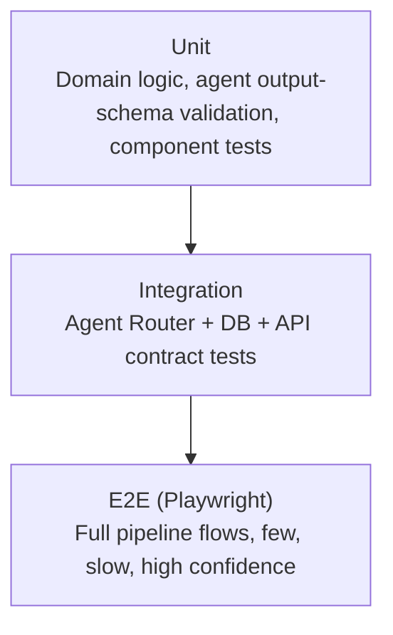

# 24 — Testing

## 24.1 Test Pyramid

Standard shape, but weighted deliberately toward two categories that are unusual for a typical CRUD SaaS and central to PARDI specifically: **agent output-contract tests** and **dependency-graph integrity tests**, both detailed below.

## 24.2 Unit Testing

| Target | What's tested |
|---|---|
| `packages/domain/artifacts` | Dependency-graph logic (staleness propagation rules, `11_System_Architecture.md §11.6`) — pure functions, no DB, fast and exhaustive |
| `packages/domain/permissions` | Role/permission matrix (`10_Information_Architecture.md §10.4`) against every role × action combination, not just happy-path |
| `packages/agents/*` | **Output-schema validation tests**: given a fixed mock model response, does the agent wrapper correctly parse, reject malformed output, and populate `sourceRefs` (`15_Agent_Workflow.md §15.5`)? These test the *wrapper contract*, not model quality (that's evaluation, §24.5) |
| `components/artifacts/shared/*` | Shared UI primitives (dual-view toggle, staleness banner) — snapshot + interaction tests, since these are used across every artifact screen per `21_Folder_Structure.md §21.3` |

Target: ≥85% line coverage on `packages/domain` and `packages/agents` wrapper logic specifically (not a blanket repo-wide number, which tends to incentivize testing the easy 20% instead of the load-bearing logic).

## 24.3 Integration Testing

| Target | What's tested |
|---|---|
| Agent Router ↔ Database | Dependency-contract enforcement (NFR-150): does the Router actually refuse to dispatch Database generation against non-`ready` stories? |
| RLS policies | Cross-tenant isolation (NFR-131/132) — automated tests attempting cross-workspace reads/writes as a non-member, asserting denial at the DB layer, not just the app layer |
| Staleness propagation end-to-end | Edit a PRD with real downstream BRD/Stories/Architecture artifacts present → assert all correct downstream artifacts (and *only* those) are marked stale with the correct `stale_reason` |
| API contract (`13_API_Specification.md`) | Contract tests per endpoint — request/response shape, error codes, streaming event sequence for `Accept: text/event-stream` requests |

## 24.4 End-to-End Testing (Playwright)

Covers the primary flow from `09_User_Flow.md §9.1` (Idea → Exported Prompts) as a small number of full-path tests, plus the secondary staleness-review flow (`§9.3`). E2E tests are intentionally few and treated as expensive — they exist to catch integration failures unit/integration tests structurally can't (real streaming behavior, real drag-and-drop Kanban interactions, real cross-screen navigation), not to duplicate coverage already owned by faster test tiers.

Playwright is also the tool referenced in `16_Prompt_Workflow.md §16.4`'s MCP guidance for acceptance-criteria-driven frontend tasks — PARDI's own E2E suite is a direct internal proof of that same pattern.

## 24.5 AI Output Quality Evaluation (Distinct from Unit/Integration Testing)

> **Decision:** Agent output *quality* (is the generated schema actually good, not just correctly shaped) is tested separately from the schema-validation unit tests in §24.2, using a curated golden-set evaluation suite, not asserted via traditional pass/fail unit tests. Reasoning: LLM output quality is not deterministic in the way code logic is, so treating it with brittle exact-match assertions produces constant false failures; instead it needs a rubric-scored evaluation process that tolerates reasonable variation while still catching real regressions.

| Eval category | Method |
|---|---|
| Stage-specific golden sets | For each pipeline stage (`14_AI_Workflow.md`), a fixed set of representative input projects (varying complexity, domain) with human-reviewed "good" reference outputs; new agent prompt versions are scored against this set before merge |
| Cross-artifact consistency | Automated check that the Reviewer Agent's flags (`15_Agent_Workflow.md`) correctly catch intentionally-seeded inconsistencies injected into golden-set fixtures (e.g., a deliberately orphaned endpoint) — a regression here means the Reviewer Agent got *worse* at its actual job |
| Prompt-output stability | For the Prompt Engineer Agent specifically (`16_Prompt_Workflow.md §16.6`), repeated generation from unchanged inputs is checked for low variance — this agent is meant to be closer to deterministic assembly than creative generation, and rising variance is itself a regression signal |
| Prompt quality bar | Human-rubric scoring (`16_Prompt_Workflow.md §16.6`'s "could a competent engineer implement this without further clarification" standard) sampled periodically, not fully automatable |

Eval results are tracked over time per agent/stage, not just at release time — a slow quality decline across several small prompt tweaks is exactly the failure mode a one-time eval at each PR could miss.

## 24.6 CI Gates (GitHub Actions)

A PR cannot merge unless, in order:

1. Type-check + lint (including the `"use client"` review rule from `21_Folder_Structure.md §21.5` and the design-token lint rule from `19_Design_Tokens.md §19.6`) passes.
2. Unit tests pass at the coverage floor (§24.2).
3. Integration tests pass, including RLS cross-tenant isolation tests (non-negotiable — a failure here blocks merge regardless of any other consideration, given NFR-131's severity).
4. Bundle-analyzer check confirms no R3F/GSAP/Lenis import leaked outside the `(marketing)` route group (`21_Folder_Structure.md §21.2`).
5. If the PR touches `packages/agents`, the relevant golden-set eval (§24.5) runs and must not regress below the previously accepted score threshold for that stage.
6. E2E smoke suite (a small, fast subset of §24.4, not the full suite) passes.

Full E2E suite and broader golden-set evaluation run on a merge-to-main schedule (not blocking every PR) given their cost, per the "expensive, few, high-confidence" framing in §24.4.

## 24.7 Cross-References

- Folder layout tests live in → `21_Folder_Structure.md §21.6`
- Deployment pipeline these gates feed into → `25_Deployment.md`
- Requirements each test tier ultimately verifies → `07_Functional_Requirements.md`, `08_Non_Functional_Requirements.md`
