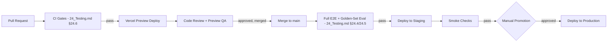

# 25 — Deployment

## 25.1 Environments

| Environment | Purpose | Deployment trigger |
|---|---|---|
| `local` | Developer machines | N/A — local Supabase/Redis via Docker Compose |
| `preview` | Per-PR ephemeral deploy (Vercel preview deployments) | Every PR, automatic |
| `staging` | Pre-production validation, mirrors production config | Merge to `main`, after CI gates (`24_Testing.md §24.6`) pass |
| `production` | Live product | Manual promotion from `staging` after smoke checks |

> **Decision:** Promotion from `staging` to `production` is a manual, explicit action, not fully automatic on every merge — even though CI gates are strict. Reasoning: given PARDI's own product thesis is about preventing costly, hard-to-detect downstream inconsistency (the staleness/dependency-graph system), the team holds its own deployment process to a standard that treats "tests passed" as necessary but not sufficient for a live release touching real user artifact data.

## 25.2 CI/CD Pipeline (GitHub Actions)

## 25.3 Database Migrations in Deployment

- Drizzle migrations run as a distinct, ordered step before the new application code is promoted — never applied implicitly by application startup, to keep migration application auditable and reversible independent of code deploy timing.
- Given `artifact_versions`/`artifact_dependencies` are treated as append-only/audit-grade (`12_Database_Design.md §12.5`), any migration touching those tables requires an explicit second reviewer sign-off beyond standard PR review, reflecting their load-bearing role in the product's core guarantee.
- Rollback strategy: application code rollback is straightforward (redeploy previous Vercel build); schema rollback is intentionally harder to justify by design (append-only tables resist easy rollback) — this is accepted as a trade-off favoring data integrity over rollback convenience, and is why migrations affecting these tables get extra review rather than relying on rollback as a safety net.

## 25.4 Worker Deployment (Docker)

Long-running queue-consumer workers (`11_System_Architecture.md §11.7`) are containerized and deployed independently of the Vercel-hosted app — separate release cadence, separate health checks, since their failure mode (a stuck generation job) has a different blast radius than a web-app deploy issue and shouldn't be coupled to the same rollback unit.

## 25.5 Rollback Strategy

| Failure type | Rollback action |
|---|---|
| Bad app code deploy (Vercel) | Instant redeploy of last known-good build via Vercel's deployment history |
| Bad worker deploy (Docker) | Redeploy last known-good container image; in-flight jobs re-queued, not lost, since queue state lives in Redis independent of worker process lifecycle |
| Bad migration (non-append-only tables) | Reverse migration applied in a follow-up deploy, tested in `staging` first |
| Bad migration (append-only artifact tables) | Forward-fix only (per §25.3) — a corrective migration is written and reviewed with the same extra-signoff bar, rather than attempting a destructive rollback against audit-grade data |
| Agent prompt regression (caught post-deploy via eval drift, `24_Testing.md §24.5`) | Prompt version pinned back to last accepted version — agent prompts are versioned artifacts themselves (NFR-171), so this is a config rollback, not a code rollback |

## 25.6 Monitoring & Alerting on Deploy

- Post-deploy automated smoke checks hit the primary flow's key endpoints (`13_API_Specification.md`) against `staging` before manual promotion is even offered as an option.
- Production deploy triggers a monitoring window where p95/p99 generation latency (`23_Performance.md §23.6`) and RLS-denial rates (`22_Security.md §22.7`) are watched specifically for anomalies versus the pre-deploy baseline, not just generic uptime.

## 25.7 Deployment Checklist (Product Feature — Output of the Pipeline Itself)

Distinct from PARDI's *own* deployment process above: the **Deployment Checklist** is also the final pipeline artifact PARDI generates *for the user's project* (`06_Product_Requirements.md §6.3` pipeline terminus). It is produced by the DevOps Engineer Agent persona (`15_Agent_Workflow.md §15.2`) from the Architecture and Tech Stack artifacts, and includes: environment setup steps, required environment variables (named, not valued), migration-order guidance, and a minimal smoke-test list — mirroring the structure of this very document, scaled down to the user's generated project. This dual meaning (PARDI's own deployment vs. the feature that generates one for users) is intentional: PARDI's own process is a living example of the checklist quality it promises to produce.

## 25.8 Cross-References

- CI gates feeding this pipeline → `24_Testing.md §24.6`
- Infrastructure topology being deployed → `11_System_Architecture.md §11.7`
- Incident-response runbook referenced on failure → `22_Security.md §22.7`
